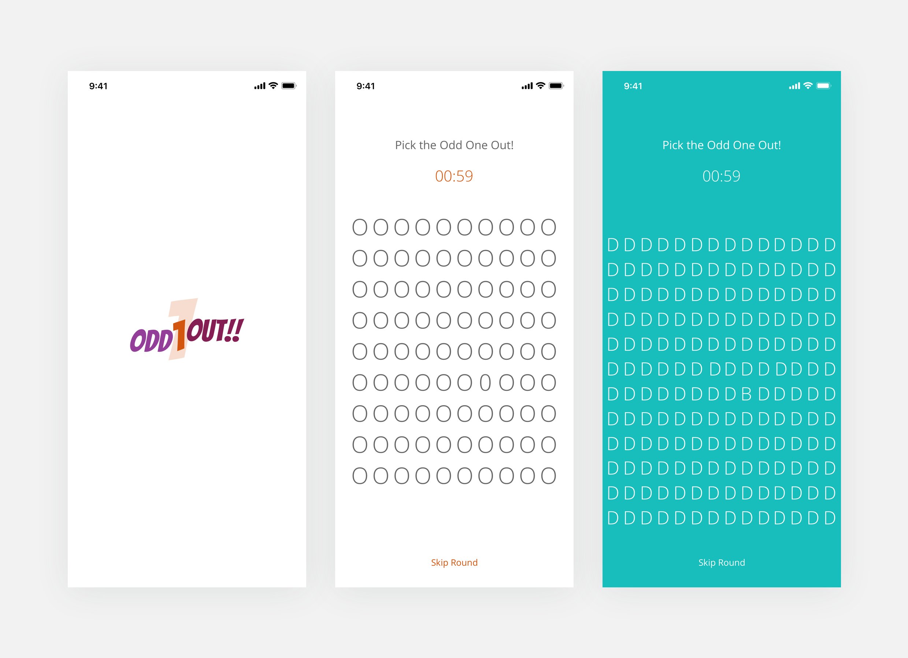

# Odd1Out
A Flutter game app
Goal: To pick the one letter that’s mismatched amongst the other letters. After each level ends, the letters and colors would keep changing, just to have a difficult time reading it.

## Game concept from Project365
https://project365.design/2018/10/04/day-277-odd1out-fun-game-concept/

## Getting Started

This project is a starting point for a Flutter application.

A few resources to get you started if this is your first Flutter project:

- [Lab: Write your first Flutter app](https://flutter.io/docs/get-started/codelab)
- [Cookbook: Useful Flutter samples](https://flutter.io/docs/cookbook)

For help getting started with Flutter, view our 
[online documentation](https://flutter.io/docs), which offers tutorials, 
samples, guidance on mobile development, and a full API reference.
